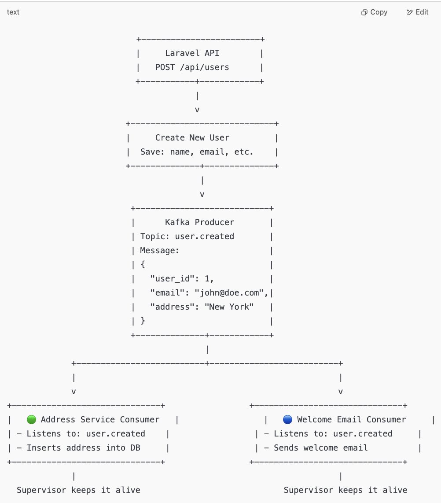
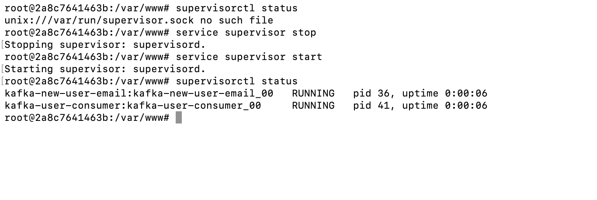
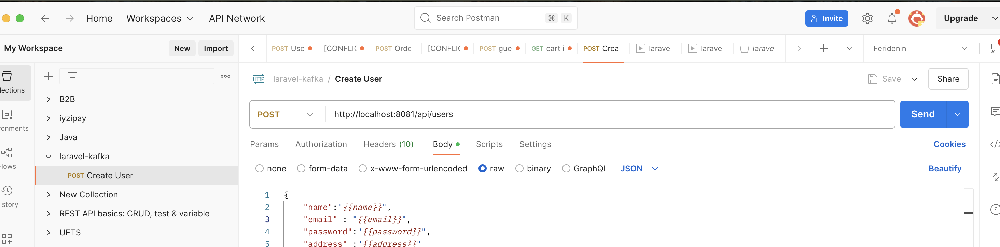
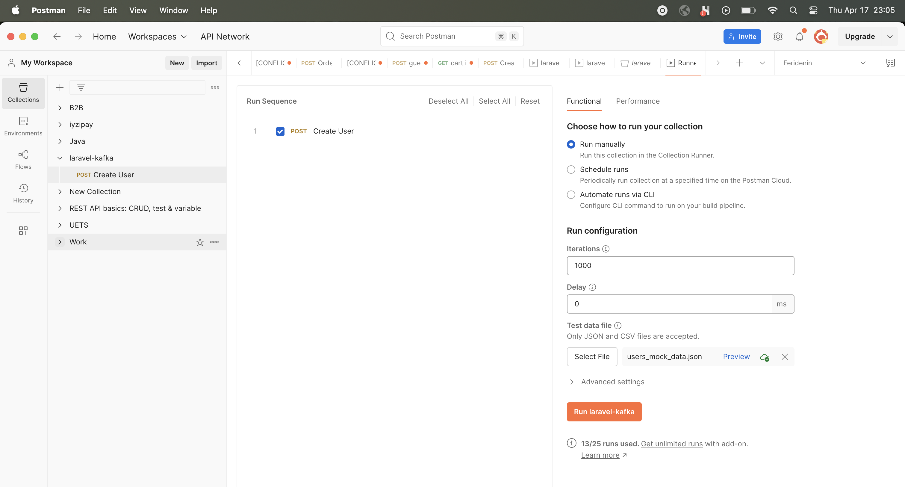
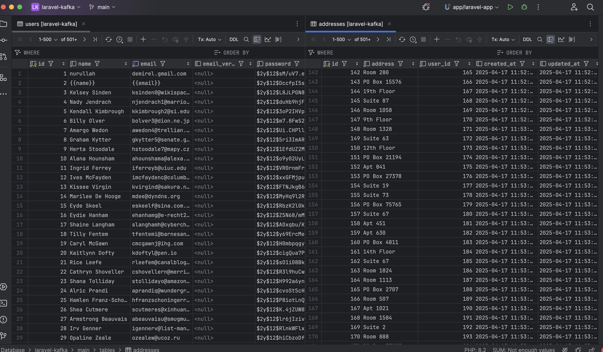
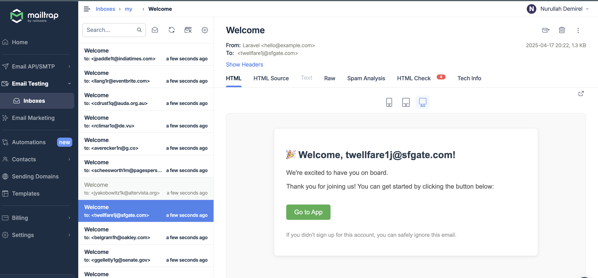

# Laravel Kafka App
Kafka sample application with Laravel.
# Technologies
  - Php
  - Laravel 
  - Nginx
  - Composer
  - Supervisor
  - Kafka
  - REST

# Steps

- Install kafka for using kafka
- install kafka-ui for monitoring kafka processes
- install nginx for web server
- install a app for php
- install require extension in order to be able to work laravel and kafka
  (composer,rdkafka)
- install supervisor to laravel app container in order to be able to run cron jobs


# Logic
- We write and endpoint to crate user in Laravel app in User Controller
- After insert the suer to Mysql, we publish payload (user_id and address)to insert addresses with
  (user_id,address,email) with user_created topic name
- there are two consumers to listen this event, after produce data; these consumers handle payload,
  kafka-new-user-email consumer sends email for created user, kafka-user-consumer consumer insert the addresses table for created user using payload



# installation

```bash
docker-compose up -d --build --force-recreate
```
If all containers were created successfully you can go into the app container

```bash
docker exec -it app bash
```
In app container you can check if supervisor workers are running

```bash
supervisorctl status
```

if you face an error you can restart supervisor service

```bash
service supervisor stop
```

```bash
service supervisor start
```

If everything is successful you must see the result after the run check command

```bash
supervisorctl status
```



If you can see result like this you can say my workers are running with supervisor successfully

After these steps we can send api request with postman using runner feature

[See Runner Feature ](https://learning.postman.com/docs/collections/running-collections/intro-to-collection-runs/)

You can import simple our postman collection for testing quickly
You can see mock data with  data/users_mock_data.json path in project




# Result
Users-Address

Emails



Notes :
- If you want more than one worker to listen same topic, you must send different group.id with same topic name when you try to consume topic
- if you want to increase performance, you can increase your consumer count
  A single topic can contain more than one partition.

- At any given time (t), a consumer reads data from only one partition.

- If you increase the number of partitions for a topic A, but keep the number of consumers the same,
you won’t observe any performance improvement.

- The consumer will still only process data from one partition at a time.
- Only when you increase the number of partitions and match that number with an equal number of consumers,
then each consumer can be assigned a separate partition.
That’s when they start processing messages in parallel, improving overall system performance.

What happens if you keep the partition count as 1 and run 3 workers (consumers)?
Only one consumer will be able to read from the partition.

The other two consumers will remain idle because Kafka allows only one consumer per partition within the same consumer group.

So even though you’re running 3 workers, only 1 will be active, and the remaining 2 will just wait without processing anything.

This setup does not improve performance or parallelism since there’s only one partition.

🔁 To benefit from multiple workers, you must increase the number of partitions in the topic.