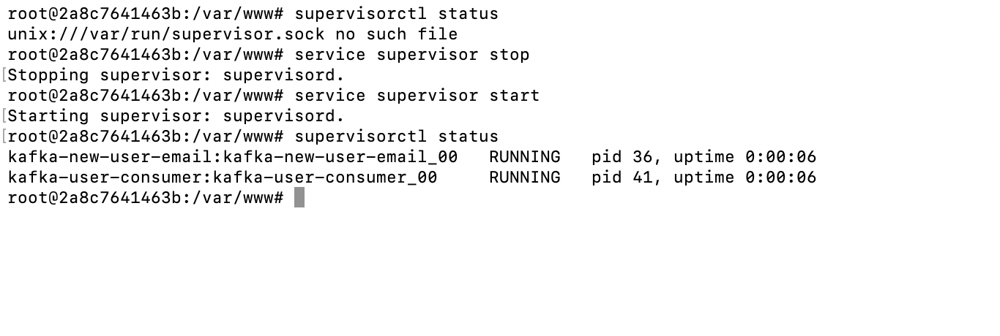
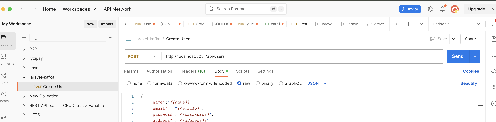
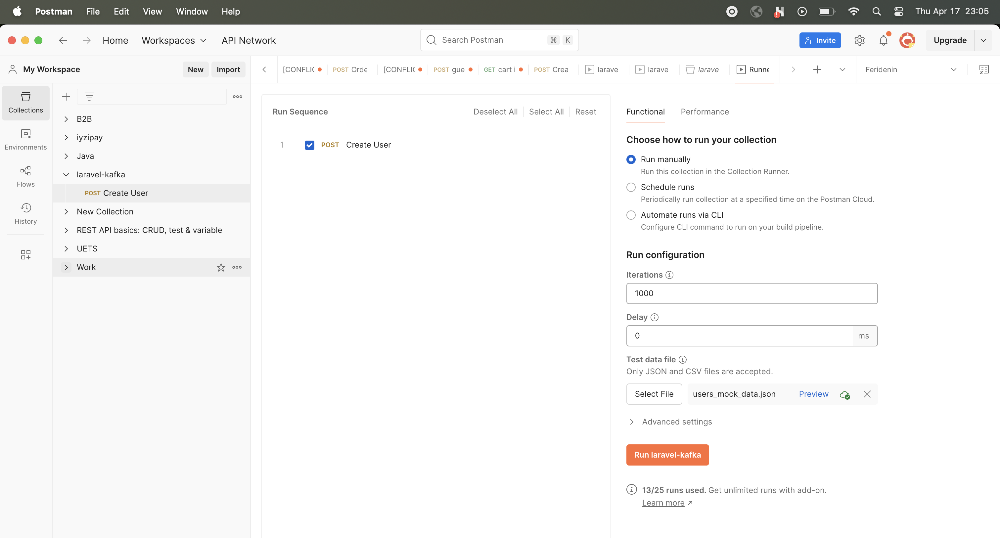
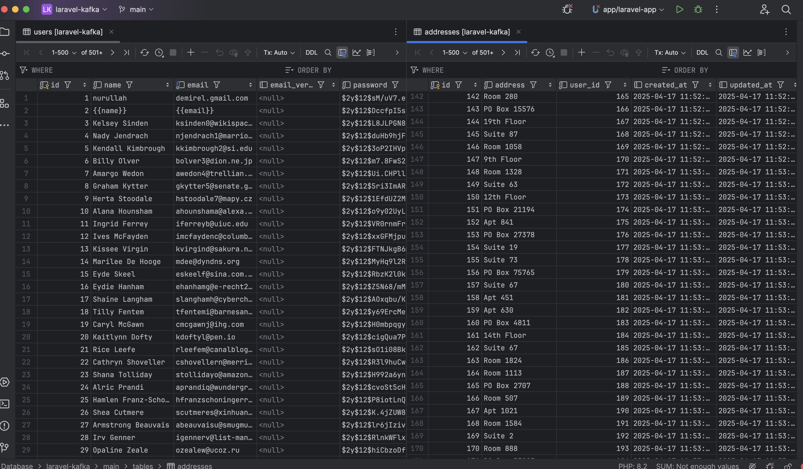
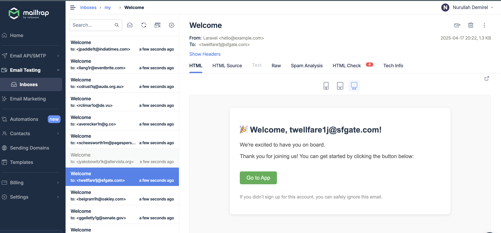

# Laravel Kafka App

Kafka example app with laravel.
## Steps

- Install kafka for using kafka
- install kafka-ui for monitoring kafka processes
- install nginx for web server
- install a app for php
- install require extension in order to be able to work laravel and kafka
  (composer,rdkafka)
- install supervisor to laravel app container in order to be able to run cron jobs


# Logic
- We write and endpoint to crate user ins Laravel app in User Controller
- After insert the suer to Mysql, we publish payload (user_id and address)to insert addresses with
  user-created topic
- After user-created consumer we publish user_id and email to send email with new_user_email topic

# installation

```bash
docker-compose up -d --build --force-recreate
```
If all containers were created successfully you can go into the app container

```bash
docker exec -it app bash
```
In app container you can check if supervisor workers are running

```bash
supervisorctl status
```

if you face an error you can restart supervisor service

```bash
service supervisor stop
```

```bash
service supervisor start
```

If everything is successful you must see the result after the run check command

```bash
supervisorctl status
```



If you can see result like this you can say my workers are running with supervisor successfully

After these steps we can send api request with postman using runner feature

[See Runner Feature ](https://learning.postman.com/docs/collections/running-collections/intro-to-collection-runs/)

You can import simple our postman collection for testing quickly
You can see mock data with  data/users_mock_data.json path in project




# Result
Users-Address

Emails



Notes :
Her consumer kendi group.id ile farklı bir mesaj kuyruğu gibi davranır.

Aynı group id verilirse sadece biri alır.

consumeStart(0, RD_KAFKA_OFFSET_END) sadece yeni mesajları dinler.

Supervisor ya da Docker entrypoint ile bu scriptleri kalıcı hale getirebilirsin.


